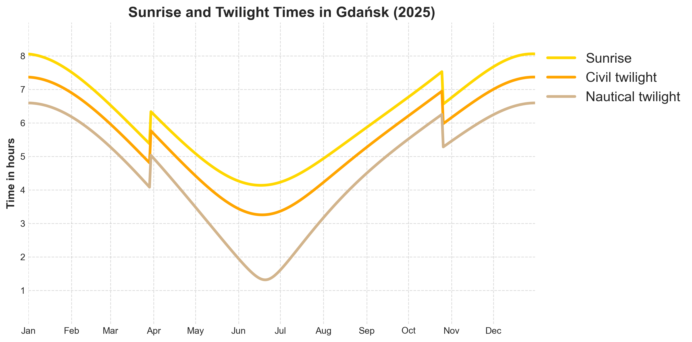

# Gdansk-Sunrises
Sunrise, civil and nautical twilight start times for Gdansk in 2025 based on public API data [sunrise-sunset.org/api](https://sunrise-sunset.org/api)

## Project files
- [sunrises_datadownload.ipynb](sunrises_datadownload.ipynb) – notebook for downloading data from the API
- [sunrises_2025.csv](sunrises_2025.csv) – saved dataset with all dates and times  
- [sunrises.ipynb](sunrises.ipynb) – notebook for generating plot  
- [sunrise_twilights.png](sunrise_twilights.png) – chart in .png

## Visualization


## Technologies
- Python 3.12
- pandas
- numpy
- matplotlib
- Jupyter Notebook

## How to run

### 1. Install required packages
```bash
pip install -r requirements.txt
```
> The dataset sunrises_2025.csv is already included in this repository. If you want to generate a dataset from the API by yourself, run the sunrises_datadownload.ipynb notebook first:
```bash
jupyter notebook sunrises_datadownload.ipynb
```
### 2. Run the visualization notebook
```bash
jupyter notebook sunrises.ipynb
```
